```python
%matplotlib inline
```

# Random Numbers and MonteCarlo Methods


```python
import numpy as np
import pandas as pd
import seaborn as sns
import pylab as plt
import scipy.stats as st
import pdir as dir
```

## Random numbers and seeds


```python
import random

random.random()
```


    0.22321073814882275


```python
[random.random() for i in range(3)]
```


    [0.7364712141640124, 0.6766994874229113, 0.8921795677048454]


```python
[random.random() for i in range(3)]
```


    [0.08693883262941615, 0.4219218196852704, 0.029797219438070344]


```python
random.seed(42)
[random.random() for i in range(3)]
```


    [0.6394267984578837, 0.025010755222666936, 0.27502931836911926]


```python
random.seed(42)
[random.random() for i in range(3)]
```


    [0.6394267984578837, 0.025010755222666936, 0.27502931836911926]


### the linear congruential generator

a very simple way of generating random numbers: not a good one, but a good example

$$R_{n+1} = (a \cdot R_n + c) \text{mod} m$$

with appropriate constants a, c and m


```python
# values from the numerical recipies
m = 2**32
a = 1664525
c = 1013904223
```


```python
R0 = 4
R1 = (a*R0+c)%m
R1
```


    1020562323


```python
for i in range(5):
    print(R1/m)
    R1 = (a*R1+c)%m
```

    0.6126509555615485
    0.06787405931390822
    0.30464745592325926
    0.5426386359613389
    0.8115915204398334


```python
results = []
for i in range(5000):
    results.append(R1/m)
    R1 = (a*R1+c)%m
```


```python
plt.hist(results)
```


    (array([480., 466., 463., 520., 504., 513., 522., 516., 504., 512.]),
     array([2.93839024e-04, 1.00261839e-01, 2.00229839e-01, 3.00197840e-01,
            4.00165840e-01, 5.00133840e-01, 6.00101840e-01, 7.00069841e-01,
            8.00037841e-01, 9.00005841e-01, 9.99973841e-01]),
     <a list of 10 Patch objects>)


    

    


## the random modules

between the standard libraries and the scientific stack, we have access to 3 set of random functions generation:

* random
* numpy.random
* scipy.stats


```python
import random as rn
dir(rn).public
```


    property:
        BPF, LOG4, NV_MAGICCONST, RECIP_BPF, SG_MAGICCONST, TWOPI
    class:
        Random: Random number generator base class used by bound module functions.
        SystemRandom: Alternate random number generator using sources provided
    function:
        betavariate: Beta distribution.
        choice: Choose a random element from a non-empty sequence.
        choices: Return a k sized list of population elements chosen with replacement.
        expovariate: Exponential distribution.
        gammavariate: Gamma distribution.  Not the gamma function!
        gauss: Gaussian distribution.
        getrandbits: getrandbits(k) -> x.  Generates an int with k random bits.
        getstate: Return internal state; can be passed to setstate() later.
        lognormvariate: Log normal distribution.
        normalvariate: Normal distribution.
        paretovariate: Pareto distribution.  alpha is the shape parameter.
        randint: Return random integer in range [a, b], including both end points.
        random: random() -> x in the interval [0, 1).
        randrange: Choose a random item from range(start, stop[, step]).
        sample: Chooses k unique random elements from a population sequence or set.
        seed: Initialize internal state from hashable object.
        setstate: Restore internal state from object returned by getstate().
        shuffle: Shuffle list x in place, and return None.
        triangular: Triangular distribution.
        uniform: Get a random number in the range [a, b) or [a, b] depending on rounding.
        vonmisesvariate: Circular data distribution.
        weibullvariate: Weibull distribution.


```python
[f for f in dir(rn) if f.endswith('variate')]
```


    ['betavariate',
     'expovariate',
     'gammavariate',
     'lognormvariate',
     'normalvariate',
     'paretovariate',
     'vonmisesvariate',
     'weibullvariate']


```python
import numpy as np
dir(np.random).public
```


    property:
        absolute_import, division, mtrand, np, operator, print_function, test, warnings
    class:
        RandomState: RandomState(seed=None)
    function:
        Lock: allocate_lock() -> lock object
        beta: beta(a, b, size=None)
        binomial: binomial(n, p, size=None)
        bytes: bytes(length)
        chisquare: chisquare(df, size=None)
        choice: choice(a, size=None, replace=True, p=None)
        dirichlet: dirichlet(alpha, size=None)
        exponential: exponential(scale=1.0, size=None)
        f: f(dfnum, dfden, size=None)
        gamma: gamma(shape, scale=1.0, size=None)
        geometric: geometric(p, size=None)
        get_state: get_state()
        gumbel: gumbel(loc=0.0, scale=1.0, size=None)
        hypergeometric: hypergeometric(ngood, nbad, nsample, size=None)
        laplace: laplace(loc=0.0, scale=1.0, size=None)
        logistic: logistic(loc=0.0, scale=1.0, size=None)
        lognormal: lognormal(mean=0.0, sigma=1.0, size=None)
        logseries: logseries(p, size=None)
        multinomial: multinomial(n, pvals, size=None)
        multivariate_normal: multivariate_normal(mean, cov[, size, check_valid, tol])
        negative_binomial: negative_binomial(n, p, size=None)
        noncentral_chisquare: noncentral_chisquare(df, nonc, size=None)
        noncentral_f: noncentral_f(dfnum, dfden, nonc, size=None)
        normal: normal(loc=0.0, scale=1.0, size=None)
        pareto: pareto(a, size=None)
        permutation: permutation(x)
        poisson: poisson(lam=1.0, size=None)
        power: power(a, size=None)
        rand: rand(d0, d1, ..., dn)
        randint: randint(low, high=None, size=None, dtype='l')
        randn: randn(d0, d1, ..., dn)
        random: random_sample(size=None)
        random_integers: random_integers(low, high=None, size=None)
        random_sample: random_sample(size=None)
        ranf: random_sample(size=None)
        rayleigh: rayleigh(scale=1.0, size=None)
        sample: random_sample(size=None)
        seed: seed(seed=None)
        set_state: set_state(state)
        shuffle: shuffle(x)
        standard_cauchy: standard_cauchy(size=None)
        standard_exponential: standard_exponential(size=None)
        standard_gamma: standard_gamma(shape, size=None)
        standard_normal: standard_normal(size=None)
        standard_t: standard_t(df, size=None)
        triangular: triangular(left, mode, right, size=None)
        uniform: uniform(low=0.0, high=1.0, size=None)
        vonmises: vonmises(mu, kappa, size=None)
        wald: wald(mean, scale, size=None)
        weibull: weibull(a, size=None)
        zipf: zipf(a, size=None)


```python
np.random.negative_binomial(n=2, p=0.5, size=10)
```


    array([1, 2, 0, 2, 0, 8, 1, 0, 5, 3])


```python

```


```python
neg_bin = np.random.negative_binomial(n=10, p=0.5, size=10000)
plt.hist(neg_bin, bins=np.linspace(0, 30, 31));
```


    

    


```python
λ = np.random.gamma(10, size=10000)
plt.hist(λ);
```


    
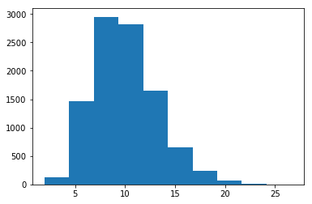
    


```python
poi_obs = np.random.poisson(λ)
plt.hist(poi_obs);
```


    
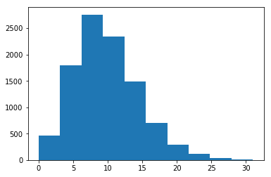
    


```python
bins=np.linspace(0, 30, 31)
plt.hist(poi_obs, bins=bins, alpha=0.4);
plt.hist(neg_bin, bins=bins, alpha=0.4);
```


    

    


```python

```


```python
import scipy.stats as st
dir(st).properties.public
```


    property:
        absolute_import, alpha, anglit, arcsine, argus, bernoulli, beta, betaprime, binom, boltzmann, bradford, burr, burr12, cauchy, chi, chi2, contingency, cosine, crystalball, dgamma, dirichlet, distributions, division, dlaplace, dweibull, erlang, expon, exponnorm, exponpow, exponweib, f, fatiguelife, fisk, foldcauchy, foldnorm, frechet_l, frechet_r, gamma, gausshyper, genexpon, genextreme, gengamma, genhalflogistic, genlogistic, gennorm, genpareto, geom, gilbrat, gompertz, gumbel_l, gumbel_r, halfcauchy, halfgennorm, halflogistic, halfnorm, hypergeom, hypsecant, invgamma, invgauss, invweibull, invwishart, johnsonsb, johnsonsu, kappa3, kappa4, kde, ksone, kstwobign, laplace, levy, levy_l, levy_stable, loggamma, logistic, loglaplace, lognorm, logser, lomax, matrix_normal, maxwell, mielke, morestats, moyal, mstats, mstats_basic, mstats_extras, multinomial, multivariate_normal, mvn, nakagami, nbinom, ncf, nct, ncx2, norm, norminvgauss, ortho_group, pareto, pearson3, planck, poisson, powerlaw, powerlognorm, powernorm, print_function, randint, random_correlation, rayleigh, rdist, recipinvgauss, reciprocal, rice, semicircular, skellam, skewnorm, special_ortho_group, statlib, stats, t, test, trapz, triang, truncexpon, truncnorm, tukeylambda, uniform, unitary_group, vonmises, vonmises_line, wald, weibull_max, weibull_min, wishart, wrapcauchy, yulesimon, zipf


```python
dir(st.gamma).public
```


    property:
        a, b, badvalue, extradoc, generic_moment, moment_type, name, numargs, shapes, vecentropy, xtol
    descriptor:
        random_state: @property with getter, setter, Get or set the RandomState object for generating random variates.
    function:
        cdf: Cumulative distribution function of the given RV.
        entropy: Differential entropy of the RV.
        expect: Calculate expected value of a function with respect to the
        fit: Return MLEs for shape (if applicable), location, and scale
        fit_loc_scale: Estimate loc and scale parameters from data using 1st and 2nd moments.
        freeze: Freeze the distribution for the given arguments.
        interval: Confidence interval with equal areas around the median.
        isf: Inverse survival function (inverse of `sf`) at q of the given RV.
        logcdf: Log of the cumulative distribution function at x of the given RV.
        logpdf: Log of the probability density function at x of the given RV.
        logsf: Log of the survival function of the given RV.
        mean: Mean of the distribution.
        median: Median of the distribution.
        moment: n-th order non-central moment of distribution.
        nnlf: Return negative loglikelihood function.
        pdf: Probability density function at x of the given RV.
        ppf: Percent point function (inverse of `cdf`) at q of the given RV.
        rvs: Random variates of given type.
        sf: Survival function (1 - `cdf`) at x of the given RV.
        stats: Some statistics of the given RV.
        std: Standard deviation of the distribution.
        var: Variance of the distribution.


all thes distributions are described using a **location** and **scale** parameter, and, if necessary, one or more **shape** parameters.

Basically they can describe all translation and scaling of the basic function.

This is usually different from the traditional parametrization, and this can lead to some problems here and there


```python
help(st.gamma.rvs)
```

    Help on method rvs in module scipy.stats._distn_infrastructure:
    
    rvs(*args, **kwds) method of scipy.stats._continuous_distns.gamma_gen instance
        Random variates of given type.
        
        Parameters
        ----------
        arg1, arg2, arg3,... : array_like
            The shape parameter(s) for the distribution (see docstring of the
            instance object for more information).
        loc : array_like, optional
            Location parameter (default=0).
        scale : array_like, optional
            Scale parameter (default=1).
        size : int or tuple of ints, optional
            Defining number of random variates (default is 1).
        random_state : None or int or ``np.random.RandomState`` instance, optional
            If int or RandomState, use it for drawing the random variates.
            If None, rely on ``self.random_state``.
            Default is None.
        
        Returns
        -------
        rvs : ndarray or scalar
            Random variates of given `size`.
    


these distributions can be used in frozen or unfrozen state.

a frozen distribution has its parameters fixed, while an unfrozen one requires them every time


```python
st.gamma.rvs(2.0, loc=0, scale=1, size=3)
```


    array([1.26527731, 2.04624127, 0.59565769])


```python
dist = st.gamma(2.0, loc=0, scale=1)
dist.rvs(3)
```


    array([0.42775444, 1.07160098, 0.92292052])


```python
x = np.linspace(0, 5, 1000)
pdf_value = dist.pdf(x)
plt.plot(x, pdf_value)
```


    [<matplotlib.lines.Line2D at 0x7feb87a60358>]


    
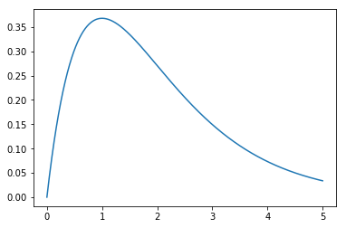
    


```python
dist = st.gamma(2.0, loc=0, scale=1)
data = dist.rvs(30)
```


```python
st.gamma.fit(data)
# alpha, location and scale
```


    (0.38060160599369985, 0.6906977809779535, 3.7548729912059065)


location is a shift, and it might not be appropriate for distributions like the gamma!
the fit method allow us to fix it to a certain value


```python
st.gamma.fit(data, floc=0)
# alpha, location and scale
```


    (2.5961195947728815, 0, 0.909155266176654)


the result is clearly better!


```python
params = st.gamma.fit(data, floc=0)
new_dist = st.gamma(*params)
```


```python
sns.distplot(dist.rvs(10_000))
sns.distplot(new_dist.rvs(10_000))
```


    <matplotlib.axes._subplots.AxesSubplot at 0x7feb87b6a470>


    
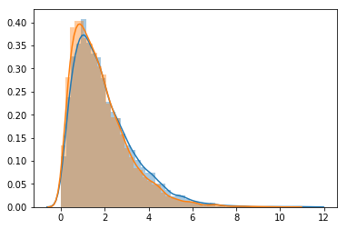
    


## Visualizing the ECDF (Empirical cumulative distribution function)


```python
data = plt.randn(4)
data
```


    array([-0.6561222 ,  1.02863093, -0.3788329 ,  0.02472737])


```python
sns.distplot(data, hist=True, kde=False);
sns.rugplot(data, height=0.1, linewidth=3, color='r');
```


    
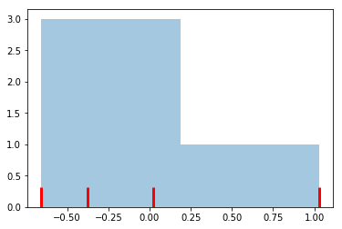
    


```python
data_sorted = np.sort(data)
index = np.linspace(0, 1, len(data_sorted))
plt.plot(data_sorted, index, linestyle='steps-pre')
sns.rugplot(data, height=0.1, 
            linewidth=3, color='r');
```


    
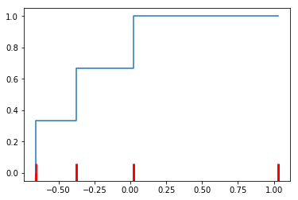
    


this is a reasonable visualization, but when we are going to use it later, the behavior is going to be closer to this:


```python
data_sorted = np.sort(data)
index = np.linspace(0, 1, len(data_sorted))
plt.plot(data_sorted, index, linestyle='steps-post')
sns.rugplot(data, height=0.1, linewidth=3, color='r');
```


    
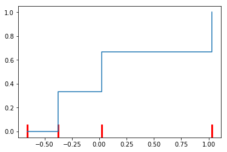
    


to reduce the borders effect, it is better to adjust how we estimate the indexes


```python
np.linspace(0, 1, 4)
```


    array([0.        , 0.33333333, 0.66666667, 1.        ])


```python
np.linspace(0, 1, 4+1)
```


    array([0.  , 0.25, 0.5 , 0.75, 1.  ])


```python
np.linspace(0, 1, 4+1)[1:]
```


    array([0.25, 0.5 , 0.75, 1.  ])


```python
np.linspace(1/4, 1, 4)
```


    array([0.25, 0.5 , 0.75, 1.  ])


```python
data_sorted = np.sort(data)

index = np.linspace(0, 1, 1+len(data_sorted))
index = index[1:]

plt.plot(data_sorted, index, linestyle='steps-post')
sns.rugplot(data, height=0.1, linewidth=3, color='r');
plt.ylim(0,1)
```


    (0, 1)


    
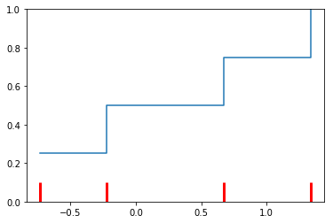
    


```python
def plot_ecdf(data, ax=None, **plot_kws):
    if ax is None:
        ax = plt.gca()
    data_sorted = np.sort(data)
    index = np.linspace(0, 1, 1+len(data_sorted))[1:]
    ax.plot(data_sorted, index, linestyle='steps-post', **plot_kws)
```


```python
plot_ecdf(plt.randn(100), color='r')
```


    
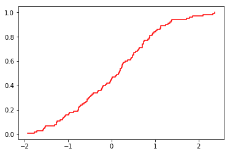
    


```python
data = (5+plt.randn(100)*5)**2
data_sorted = np.sort(data)
est_ecdf = np.linspace(0, 1, len(data_sorted)+1)[1:]

dist = st.gamma
params = dist.fit(data_sorted)
frozen = dist(*params)
teo_ecdf = 1-frozen.sf(data_sorted)
```


```python
fig, (ax0, ax1, ax2) = plt.subplots(1, 3, figsize=(18, 6))

counts, bins, _ = ax0.hist(data, density=True, alpha=0.5, bins=40)
x = np.linspace(0, np.max(bins))
ax0.plot(x, frozen.pdf(x))
ax0.set_title("histogram plot")

ax1.plot(data_sorted, teo_ecdf, color='b')
ax1.plot(data_sorted, est_ecdf, color='r')
ax1.set_title("ecdf plot")

ax2.scatter(teo_ecdf, est_ecdf)
ax2.plot(teo_ecdf, teo_ecdf, color='r')
ax2.set_title("quantile quantile plot")
```


    Text(0.5, 1.0, 'quantile quantile plot')


    
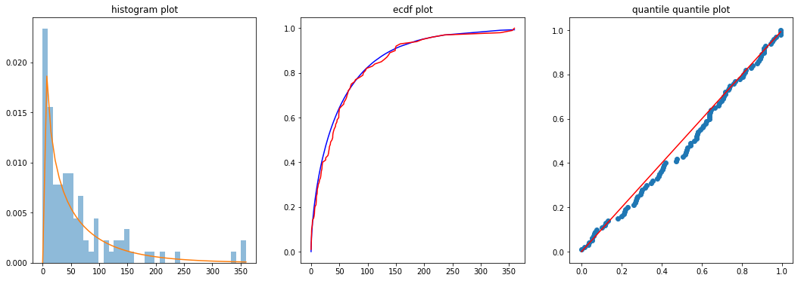
    


```python
data = (5+plt.randn(100))**2

dist = st.norm
params = dist.fit(data)
frozen = dist(*params)

for i in range(100):
    fake_data = frozen.rvs(len(data))
    plot_ecdf(fake_data, color='r', alpha=0.05, linewidth=3)
plot_ecdf(data, linewidth=3)
```


    

    


## Generating numbers with the ECDF

Being able to describe the ECDF, even as an approximation, allow us to generate random numbers with an arbitrary complicated distribution!


```python
plt.rand()
```


    0.13041370191935675


```python
data = (5+plt.randn(100))**2
data_sorted = np.sort(data)
est_ecdf = np.linspace(0, 1, 1+len(data_sorted))[1:]
```


```python
np.searchsorted([0.25, 0.5, 1], 0.15)
```


    0


```python
est_ecdf
```


    array([0.01, 0.02, 0.03, 0.04, 0.05, 0.06, 0.07, 0.08, 0.09, 0.1 , 0.11,
           0.12, 0.13, 0.14, 0.15, 0.16, 0.17, 0.18, 0.19, 0.2 , 0.21, 0.22,
           0.23, 0.24, 0.25, 0.26, 0.27, 0.28, 0.29, 0.3 , 0.31, 0.32, 0.33,
           0.34, 0.35, 0.36, 0.37, 0.38, 0.39, 0.4 , 0.41, 0.42, 0.43, 0.44,
           0.45, 0.46, 0.47, 0.48, 0.49, 0.5 , 0.51, 0.52, 0.53, 0.54, 0.55,
           0.56, 0.57, 0.58, 0.59, 0.6 , 0.61, 0.62, 0.63, 0.64, 0.65, 0.66,
           0.67, 0.68, 0.69, 0.7 , 0.71, 0.72, 0.73, 0.74, 0.75, 0.76, 0.77,
           0.78, 0.79, 0.8 , 0.81, 0.82, 0.83, 0.84, 0.85, 0.86, 0.87, 0.88,
           0.89, 0.9 , 0.91, 0.92, 0.93, 0.94, 0.95, 0.96, 0.97, 0.98, 0.99,
           1.  ])


```python
p = plt.rand()
idx = np.searchsorted(est_ecdf, p)
val = data_sorted[idx]
val
```


    20.115462913749713


```python
p = plt.rand(10)
idx = np.searchsorted(est_ecdf, p)
val = data_sorted[idx]
val
```


    array([28.78496923, 31.64769229, 35.78583449, 35.78583449, 32.61468568,
           20.35828101, 16.95870004, 18.15856544, 35.78583449, 18.14873844])


```python
p = plt.rand(100_000)
idx = np.searchsorted(est_ecdf, p)
generated = data_sorted[idx]
```


```python
sns.distplot(data, hist=False, kde=False, rug=True);
sns.distplot(generated, hist=True, kde=False, rug=False);
```


    
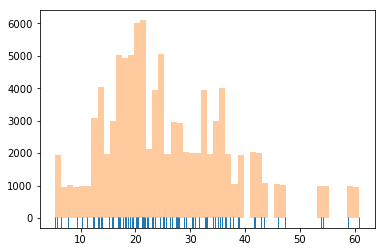
    


```python
1-st.norm.isf(0.3)
```


    0.4755994872919591


```python
p = plt.rand(100_000)
norm_data = 1-st.norm.isf(p)
sns.distplot(norm_data)
```


    <matplotlib.axes._subplots.AxesSubplot at 0x7feb7eef56d8>


    
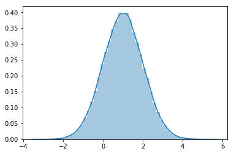
    


## Monte Carlo methods

a collection of methods that uses random sequences to estimate the average value of some specific functions, often integrals.

we saw an example of this when we estimated the value of $\pi$ using random numbers

$$ \int_{[0,1]^s} f(u)\,{\rm d}u \approx \frac{1}{N}\,\sum_{i=1}^N f(x_i). $$

the rate of convergence by using N random numbers is $O\left(\frac{1}{\sqrt{N}}\right)$

the rate of convergence using a uniform sampling of N numbers is $O\left(\frac{1}{N}\right)$

Sampling using random numbers converge more slowly, but can be performed for as long as we want until we reach the convergence up to a certain precision.

with uniformely sampled numbers, if the chosen sampling wasn't enough, we have to start from scratch and redo everything.

There are better methods for exploring a function if we can, and that is by using **low-discrepancy sequences**.

These are sequences that looks quite random, but do not tend to cluster as random numbers do, covering the space in a more uniform way.

The big advantage is that they keep having this property if we continue forward witht the sequence of sampling.

low-discrepancy sequences converge with $O\left(\frac{1}{N}\right)$, but they are a little more difficult to implement.

These methods are called quasi-Monte Carlo, as they are not using proper pseudo-random numbers


```python
p = plt.rand(100)
norm_data = 1-st.norm.isf(p)
sns.distplot(norm_data)
```


    <matplotlib.axes._subplots.AxesSubplot at 0x7feb7f0082e8>


    
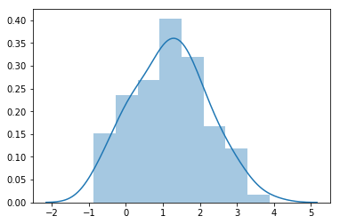
    


```python
p = np.linspace(1/100, 1-1/100, 100)
norm_data = 1-st.norm.isf(p)
sns.distplot(norm_data)
```


    <matplotlib.axes._subplots.AxesSubplot at 0x7feb7d2a6550>


    
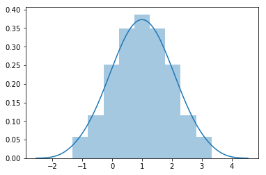
    


```python
N = 100
p = plt.rand(N)
norm_data_rand = 1-st.norm.isf(p)
p = np.linspace(1/N, 1-1/N, N)
norm_data_samp = 1-st.norm.isf(p)
sns.distplot(norm_data_rand, color='r')
sns.distplot(norm_data_samp, color='b')
```


    <matplotlib.axes._subplots.AxesSubplot at 0x7feb7d2a00f0>


    
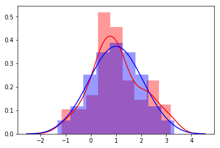
    


The simplest low-discrepancy sequence is the **Van der Corput sequence**, and is quite easy to implement:

the denominators are increasing powers of the base, the numerators are all the values in that base, but sorted base on the last digit (skipping the numbers that ends in 0, as they would simplify and recreate previous ones)

$$\left\{ \tfrac{1}{10}, \tfrac{2}{10}, \tfrac{3}{10}, \tfrac{4}{10}, \tfrac{5}{10}, \tfrac{6}{10}, \tfrac{7}{10}, \tfrac{8}{10}, \tfrac{9}{10}, \tfrac{01}{100}, \tfrac{11}{100}, \tfrac{21}{100}, \tfrac{31}{100}, \tfrac{41}{100}, \tfrac{51}{100}, \tfrac{61}{100}, \tfrac{71}{100}, \tfrac{81}{100}, \tfrac{91}{100}, \tfrac{02}{100}, \tfrac{12}{100}, \tfrac{22}{100}, \tfrac{32}{100}, \ldots \right\}$$


```python
def vdc(n, base=2):
    vdc = 0
    denom = 1
    while n:
        denom *= base
        n, remainder = divmod(n, base)
        vdc += remainder / denom
    return vdc

def avdn(n, base=10):
    return np.array([vdc(i, base=base) for i in range(1, n+1)])
```


```python
avdn(11)
```


    array([0.1 , 0.2 , 0.3 , 0.4 , 0.5 , 0.6 , 0.7 , 0.8 , 0.9 , 0.01, 0.11])


```python
from fractions import Fraction
[vdc(i, base=Fraction(10)) for i in range(1, 11)]
```


    [Fraction(1, 10),
     Fraction(1, 5),
     Fraction(3, 10),
     Fraction(2, 5),
     Fraction(1, 2),
     Fraction(3, 5),
     Fraction(7, 10),
     Fraction(4, 5),
     Fraction(9, 10),
     Fraction(1, 100)]


```python
avdn(11, base=2)
```


    array([0.5   , 0.25  , 0.75  , 0.125 , 0.625 , 0.375 , 0.875 , 0.0625,
           0.5625, 0.3125, 0.8125])


```python
fig, (ax1, ax2) = plt.subplots(1, 2, figsize=(12, 6))
bins = np.linspace(0, 1, 21)
ax1.hist(np.random.rand(1000), bins=bins)
ax2.hist(avdn(1000), bins=bins);
```


    
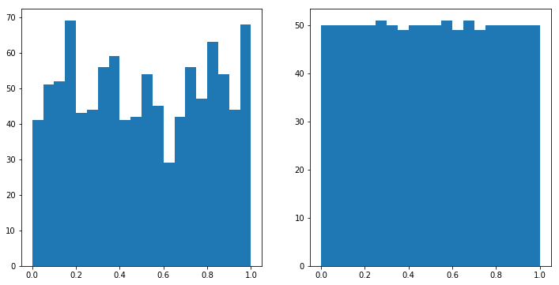
    


being a uniform sample generator, one can then use this to generate arbitrary random variables!

for example, to combined them to generate normally distributed data, we can use the **isf** function of the distributions!


```python
st.norm.isf(0.2)
```


    0.8416212335729142


```python
st.norm.isf(0.9)
```


    -1.2815515655446004


```python
fig, (ax1, ax2) = plt.subplots(1, 2, figsize=(12, 6))
ax1.hist(plt.randn(1000), bins=50);

vdn_sample = avdn(1000)
gaussian_samples = st.norm.isf(vdn_sample)
ax2.hist(gaussian_samples, bins=50);
```


    
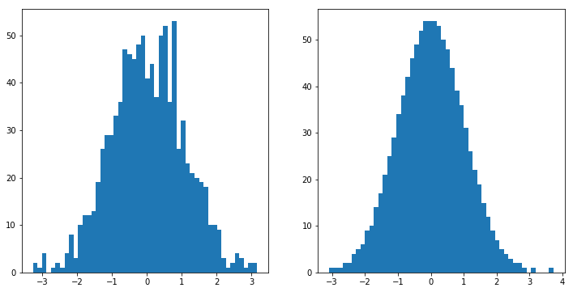
    


the Van der Corput sequence can be generalized to multiple dimensions at the same time by the **Halton sequence**, that is generated in a similar fashion

A general library to generate these sequences in high dimensions is provided by the library **SALib**.

You won't need it for today, but for real use, where the number of dimensions is high, it might be worth using it.


```python
from SALib.sample import saltelli
```


```python
problem = {
    'num_vars': 2,
    'names': ['x1', 'x2'],
    'bounds': [[0, 1],
               [0, 1],]
}
```


```python
param_values = saltelli.sample(problem, 100)
```


```python
plt.scatter(*param_values.T)
```


    <matplotlib.collections.PathCollection at 0x7feb8047e588>


    
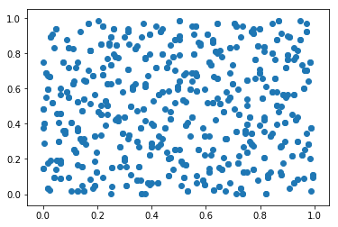
    


An interesting alternative is a low-discrepancy series , [based on the golden ratio numbers](http://extremelearning.com.au/unreasonable-effectiveness-of-quasirandom-sequences/)

It is very simple to implement as it is fundamentally similar to the traditional linear congruential generator.


```python
import numpy as np
import scipy.stats as st
import pylab as plt
import pandas as pd
import seaborn as sns
```


```python
# Using the above nested radical formula for g=phi_d 
# or you could just hard-code it. 
# phi(1) = 1.61803398874989484820458683436563 
# phi(2) = 1.32471795724474602596090885447809 
def phi(d, precision=30): 
    x = 2.00
    for i in range(precision): 
        x = pow(1+x,1/(d+1)) 
    return x
```


```python
def gaussian_icdf(q):
    return st.norm.isf(q)

def identity(x):
    return x
```


```python
# this is an iterable version
def Rϕ(ndim=1, *, seed=0.5, mapper=identity):
    g = phi(ndim) 
    alpha = ((1/g)**np.arange(1, ndim+1))%1        
    z = np.ones(ndim)*seed
    while True:
        yield mapper(z)
        z = (z+alpha) %1 
```


```python
for idx, number in zip(range(5), Rϕ(ndim=2)):
    print(idx, number)
```

    0 [0.5 0.5]
    1 [0.25487767 0.06984029]
    2 [0.00975533 0.63968058]
    3 [0.764633   0.20952087]
    4 [0.51951066 0.77936116]


```python
fig, ax = plt.subplots()
N = 50
for idx, number in zip(range(N), Rϕ(ndim=2)):
    ax.scatter(*number, color='teal')
```


    
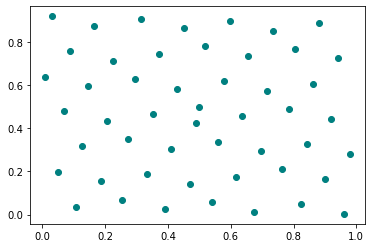
    


```python
# this is an array version, for testing speed
def a_generate(ndim, Npoints, *, seed=0.5, mapper=identity):
    # get the base for the dimension
    g = phi(ndim) 
    # this is the inizialization constant for the array
    alpha = ((1/g)**np.arange(1, ndim+1))%1  
    # reshaping to allow broadcasting
    alpha = alpha.reshape(1, -1) 
    # just the count of the sequence
    base = np.arange(Npoints).reshape(-1, 1) 
    # perform the actual calculation
    z = seed + alpha*base 
    # tale only the decimal part
    z = z % 1
    # return a mapped version to some distribution
    return mapper(z) 
```


```python
a_generate(1, 10, mapper=gaussian_icdf)
```


    array([[ 0.        ],
           [ 1.18487221],
           [-0.63126993],
           [ 0.37426935],
           [-1.91315596],
           [-0.22798216],
           [ 0.81266899],
           [-0.93940245],
           [ 0.14014703],
           [ 1.53570072]])


```python
rn = a_generate(1, 30, mapper=gaussian_icdf)
sns.distplot(rn)
```

    /home/enrico/miniconda3/lib/python3.8/site-packages/seaborn/distributions.py:2557: FutureWarning: `distplot` is a deprecated function and will be removed in a future version. Please adapt your code to use either `displot` (a figure-level function with similar flexibility) or `histplot` (an axes-level function for histograms).
      warnings.warn(msg, FutureWarning)


    <AxesSubplot:ylabel='Density'>


    
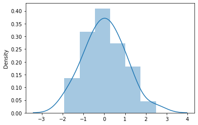
    


```python
b0 = a_generate(1, 1000, mapper=st.norm(loc=3, scale=0.1).isf)
sns.distplot(b0)
```

    /home/enrico/miniconda3/lib/python3.8/site-packages/seaborn/distributions.py:2557: FutureWarning: `distplot` is a deprecated function and will be removed in a future version. Please adapt your code to use either `displot` (a figure-level function with similar flexibility) or `histplot` (an axes-level function for histograms).
      warnings.warn(msg, FutureWarning)


    <AxesSubplot:ylabel='Density'>


    
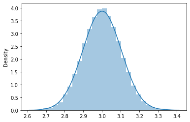
    


```python
N = 100_000
x_r = a_generate(1, N, mapper=gaussian_icdf)
x_g = plt.randn(N)

n = np.arange(1, len(x_r)+1)
res_r = np.cumsum(x_r)/n
res_g = np.cumsum(x_g)/n

r = 10
plt.plot(n[r:], abs(res_r)[r:])
plt.plot(n[r:], abs(res_g)[r:])
plt.loglog()
```


    []


    

    


## sensitivity analysis of ODE with random numbers


```python
from scipy.integrate import odeint

def exponential_deriv(state, time, alpha):
    return -alpha*state

time = np.linspace(0, 5, 21)
y0 = 1
α = 0.3
```


```python
res = odeint(exponential_deriv, y0=y0, t=time, args=(α, ))
```


```python
res
```


    array([[1.        ],
           [0.92774351],
           [0.860708  ],
           [0.79851623],
           [0.7408182 ],
           [0.68728927],
           [0.63762818],
           [0.59155538],
           [0.54881165],
           [0.50915644],
           [0.47236657],
           [0.43823501],
           [0.40656968],
           [0.37719238],
           [0.34993777],
           [0.32465248],
           [0.30119421],
           [0.27943097],
           [0.25924026],
           [0.24050846],
           [0.22313016]])


```python
res = pd.DataFrame(res, columns=['y'])
res['time'] = time
res['α'] = α

res.head()
```


<div>
<style scoped>
    .dataframe tbody tr th:only-of-type {
        vertical-align: middle;
    }

    .dataframe tbody tr th {
        vertical-align: top;
    }

    .dataframe thead th {
        text-align: right;
    }
</style>
<table border="1" class="dataframe">
  <thead>
    <tr style="text-align: right;">
      <th></th>
      <th>y</th>
      <th>time</th>
      <th>α</th>
    </tr>
  </thead>
  <tbody>
    <tr>
      <th>0</th>
      <td>1.000000</td>
      <td>0.00</td>
      <td>0.3</td>
    </tr>
    <tr>
      <th>1</th>
      <td>0.927744</td>
      <td>0.25</td>
      <td>0.3</td>
    </tr>
    <tr>
      <th>2</th>
      <td>0.860708</td>
      <td>0.50</td>
      <td>0.3</td>
    </tr>
    <tr>
      <th>3</th>
      <td>0.798516</td>
      <td>0.75</td>
      <td>0.3</td>
    </tr>
    <tr>
      <th>4</th>
      <td>0.740818</td>
      <td>1.00</td>
      <td>0.3</td>
    </tr>
  </tbody>
</table>
</div>


```python
plt.scatter(x='time', y='y', data=res)
```


    <matplotlib.collections.PathCollection at 0x7feb7f94c048>


    

    


```python
def exponential_deriv(state, time, alpha):
    return -alpha*state

time = np.linspace(0, 5, 2**4+1)
results = []
alphas = np.exp(np.random.randn(20)*0.1)

for idx, α in enumerate(alphas):
    res = odeint(exponential_deriv, y0=1, t=time, args=(α, ))
    res = pd.DataFrame(res, columns=['y'])
    res['time'] = time
    res['α'] = α
    res['simulation_run'] = idx
    results.append(res)
results = pd.concat(results)
```


```python
results.head()
```


<div>
<style scoped>
    .dataframe tbody tr th:only-of-type {
        vertical-align: middle;
    }

    .dataframe tbody tr th {
        vertical-align: top;
    }

    .dataframe thead th {
        text-align: right;
    }
</style>
<table border="1" class="dataframe">
  <thead>
    <tr style="text-align: right;">
      <th></th>
      <th>y</th>
      <th>time</th>
      <th>α</th>
      <th>simulation_run</th>
    </tr>
  </thead>
  <tbody>
    <tr>
      <th>0</th>
      <td>1.000000</td>
      <td>0.0000</td>
      <td>0.902178</td>
      <td>0</td>
    </tr>
    <tr>
      <th>1</th>
      <td>0.754326</td>
      <td>0.3125</td>
      <td>0.902178</td>
      <td>0</td>
    </tr>
    <tr>
      <th>2</th>
      <td>0.569008</td>
      <td>0.6250</td>
      <td>0.902178</td>
      <td>0</td>
    </tr>
    <tr>
      <th>3</th>
      <td>0.429217</td>
      <td>0.9375</td>
      <td>0.902178</td>
      <td>0</td>
    </tr>
    <tr>
      <th>4</th>
      <td>0.323770</td>
      <td>1.2500</td>
      <td>0.902178</td>
      <td>0</td>
    </tr>
  </tbody>
</table>
</div>


```python
sns.distplot(alphas);
```


    
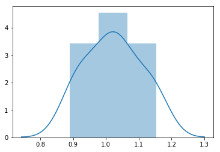
    


```python
sns.lineplot("time", 'y', data=results, 
             estimator=None, 
             units='simulation_run', 
             hue='α')
```


    <matplotlib.axes._subplots.AxesSubplot at 0x7feb7d17b828>


    
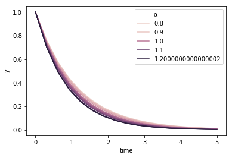
    


```python
sns.lineplot("time", 'y', data=results.query("time>0.5 and time<2"),
             estimator=None,
             units='simulation_run',
             hue='α')
```


    <matplotlib.axes._subplots.AxesSubplot at 0x7feb7d0b9ba8>


    
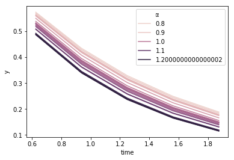
    


```python
def exponential_deriv(state, time, alpha):
    return -alpha*state

time = np.linspace(0, 5, 2**4+1)
results = []

vdn_sample = avdn(20)
gaussian_samples = st.norm.isf(vdn_sample)
alphas = np.exp(gaussian_samples*0.1)
    
for idx, α in enumerate(alphas):
    res = odeint(exponential_deriv, y0=1, t=time, args=(α, ))
    res = pd.DataFrame(res, columns=['y'])
    res['time'] = time
    res['α'] = α
    res['simulation_run'] = idx
    results.append(res)
results = pd.concat(results)
```


```python
sns.distplot(alphas)
```


    <matplotlib.axes._subplots.AxesSubplot at 0x7feb7d21def0>


    
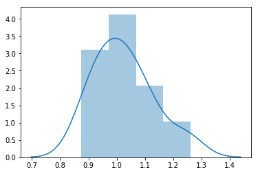
    


```python
sns.lineplot("time", 'y', data=results, estimator=None, units='simulation_run', hue='α')
```


    <matplotlib.axes._subplots.AxesSubplot at 0x7feb7cf63208>


    
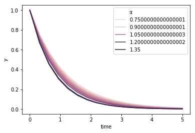
    


```python
sns.lineplot("time", 'y', data=results.query("time>0.5 and time<2"),
             estimator=None, units='simulation_run', hue='α')
```


    <matplotlib.axes._subplots.AxesSubplot at 0x7feb7cf1d358>


    

    


```python

```
